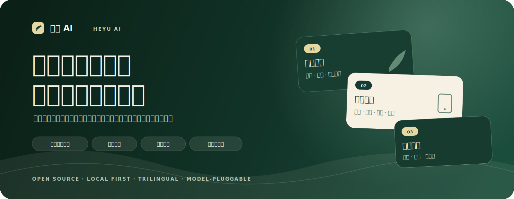
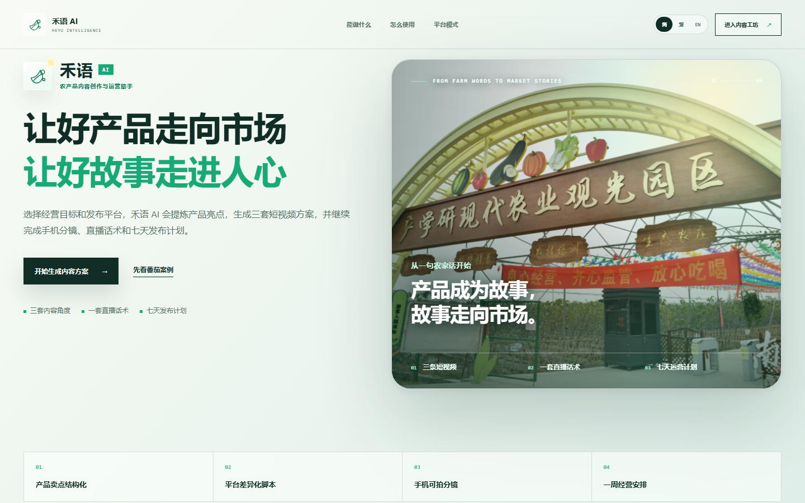
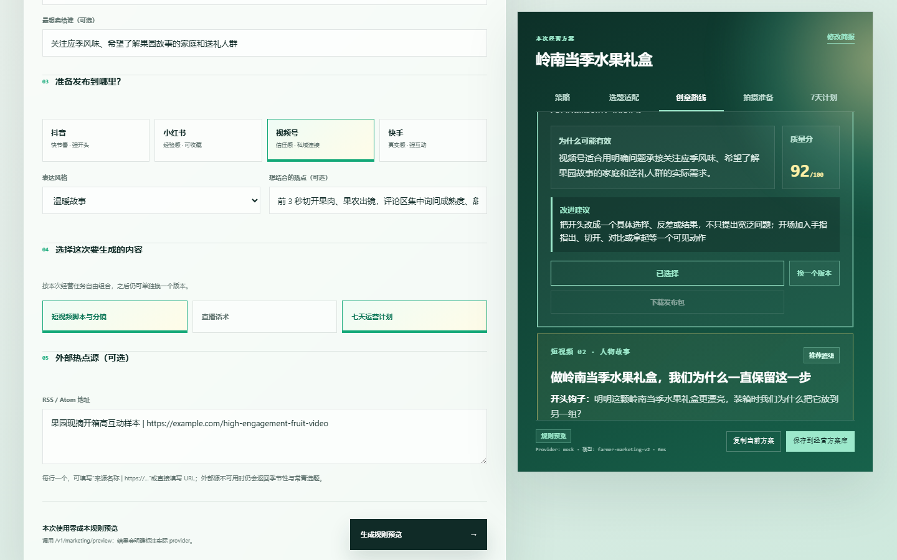
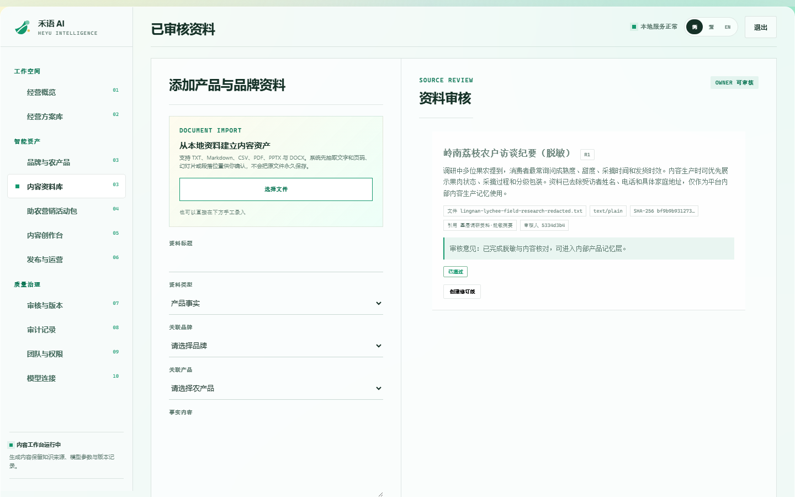
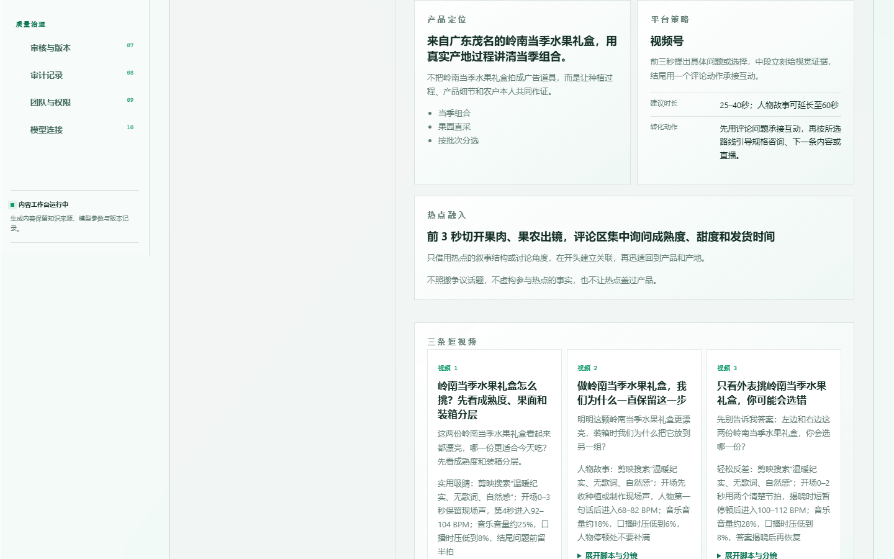
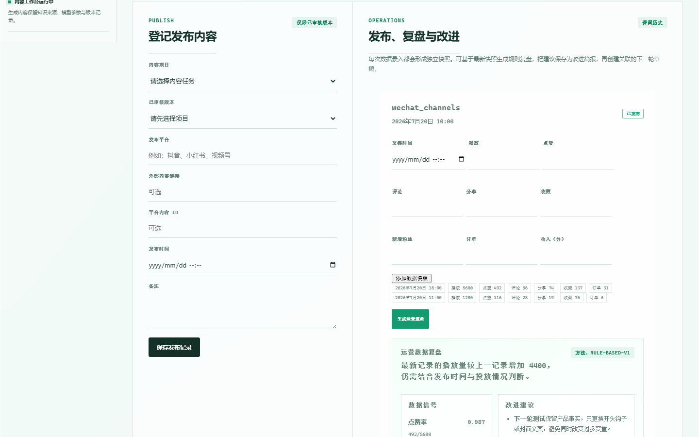
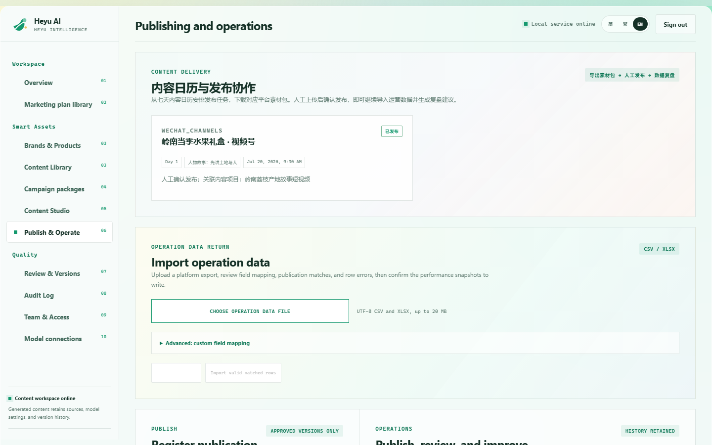
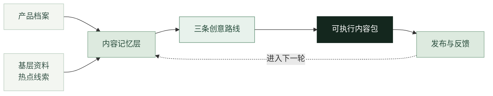
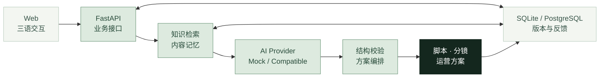

<p align="center">
  
</p>

<div align="center">

**面向农户、合作社与乡村内容团队的开源农产品内容生产平台**

把产品档案、基层调研、热点线索和发布反馈连成一条可以持续复用的内容生产链路。

<p>
  <a href="https://github.com/KayZhongyi/heyu-ai/actions/workflows/ci.yml"></a>
  
  
  
  
  <a href="LICENSE"></a>
</p>

[看懂产品](#overview) · [查看界面](#product) · [本地启动](#quick-start) · [技术架构](#architecture) · [参与建设](#contributing)

</div>

<!-- 最终比赛演示视频或 GIF 将放在这里。 -->

<a id="overview"></a>

## 30 秒看懂禾语 AI

禾语 AI 不是只生成一段文案的聊天页面。它先整理产品与经营背景，再生成相互匹配的选题、口播、分镜和发布建议；内容发布后，方案、版本与运营结果会继续留在系统中，成为下一轮生产的依据。

<table>
  <tr>
    <td width="25%" valign="top">
      <strong>01 · 认识产品</strong><br><br>
      <sub>录入品种、产地、受众、经营目标和发布平台。</sub>
    </td>
    <td width="25%" valign="top">
      <strong>02 · 找到依据</strong><br><br>
      <sub>调用已授权资料、历史方案，也可加入用户提供的热点线索。</sub>
    </td>
    <td width="25%" valign="top">
      <strong>03 · 直接开拍</strong><br><br>
      <sub>获得创意路线、标题、口播、手机分镜和拍摄清单。</sub>
    </td>
    <td width="25%" valign="top">
      <strong>04 · 继续经营</strong><br><br>
      <sub>保存版本、登记发布结果，让反馈进入下一轮内容。</sub>
    </td>
  </tr>
</table>

> **一句话定位：** 禾语 AI 是农产品内容生产的基础设施——它把散落在访谈、产品资料和过往内容里的经验，变成下一条可以直接开拍的方案。

### 预计完整产品形态

禾语 AI 的目标，是让一款农产品拥有可以持续积累的内容档案。第一次使用时，平台帮助用户认识产品、确定受众并完成拍摄方案；内容发布以后，平台继续记录版本、反馈和经营结果，再给出下一轮建议。

README 同时展示产品蓝图和当前代码进度。页面截图均来自现有版本；尚未完成的能力会明确标为“建设中”或“规划中”。

| 能力 | 预计使用方式 | 当前进度 |
| --- | --- | --- |
| 基层知识记忆 | 把获得授权并完成脱敏的访谈、调研案例、产品资料和地方产业经验作为内部生成依据，不向普通用户公开原始资料索引 | **已实现核心流程**：文件导入、分块、检索、来源关联与权限控制 |
| 产品与经营记忆 | 持续保存品牌、产品、历史方案、内容版本、发布记录和运营反馈，下一次生成不必重新介绍同一款产品 | **已实现核心流程**：档案、方案库、版本、发布与运营记录 |
| 高热内容适配 | 用户提交看到的高热视频、标题、链接或内容线索，平台判断其与产品、受众、平台和拍摄条件是否匹配，再提取可复用的叙事结构 | **部分已实现**：热点描述、来源链接、RSS/Atom 与适配判断；视频转写和镜头结构识别建设中 |
| 营销定位与内容策略 | 根据产品事实、经营目标和目标受众形成产品定位、平台重点、选题方向与转化动作 | **已实现**：结构化经营简报、平台策略、三条创意路线与选题适配 |
| 完整内容生产 | 围绕同一目标生成标题、封面、前三秒开头、完整口播、手机分镜、BGM 方向、拍摄准备和七天发布安排 | **已实现**：三条路线及其完整拍摄内容包 |
| 发布后的持续运营 | 登记发布时间、平台、链接和表现数据，根据评论、私信与内容效果提出下一轮选题和回复建议 | **部分已实现**：发布任务、运营数据与方案回流；自动复盘和个体化建议继续完善 |
| 多语种与出海适配 | 在保留产地事实和产品定位的前提下，为简体中文、香港繁体中文和英文受众调整表达、标题与平台节奏 | **已实现三语基础链路**；更多地区语言、平台模板和单位表达规划中 |
| 本地运行与模型替换 | 使用 Mock 零成本体验，也可以接入国产云模型、本地推理服务或其他 OpenAI-compatible 服务 | **已实现**：SQLite、本地启动、模型适配、缓存与降级 |
| 团队协作与交付 | 团队共同维护资料、内容和版本，并把方案导出为可继续编辑或直接交付的文件 | **已实现核心流程**：组织权限、版本、Word/PDF/PPTX 与素材包导出 |

### 用户最终会拿到什么

| 产出 | 内容 |
| --- | --- |
| 内容决策 | 产品定位、核心受众、平台策略、热点适配结论与本轮内容目标 |
| 创意选择 | 三条互不重复的创意路线，以及每条路线的适用原因和改进建议 |
| 拍摄执行包 | 标题、封面文案、完整口播、逐秒手机分镜、BGM 方向、拍摄清单和结尾动作 |
| 发布运营包 | 七天发布安排、评论与私信承接建议、内容复用方式和下一轮选题 |
| 长期经营档案 | 历史方案、人工修改版本、发布记录、运营数据和后续优化依据 |
| 对外交付文件 | 三语内容，以及 Word、PDF、PPTX 和平台素材 ZIP 等可下载文件 |

### 真正的差别，在生成之前和发布之后

|  | 常见通用 AI 使用方式 | 禾语 AI |
| --- | --- | --- |
| 内容依据 | 每次临时描述产品，结果依赖当前 Prompt | 关联产品档案、已授权基层资料、历史方案与经营记录 |
| 热点使用 | 用户自行判断是否适合，再要求模型仿写 | 先判断产品、受众、平台、时效和拍摄条件，再重组为自己的选题 |
| 交付结果 | 得到一段文案或单个脚本 | 同时得到三条创意路线、完整口播、手机分镜、拍摄准备和发布建议 |
| 后续经营 | 对话结束后，发布结果需要另行保存 | 方案、版本、发布记录和运营反馈在同一工作台持续积累 |

### 四个核心能力

#### 1. 真实基层资料成为内容依据

经过授权与脱敏的农户访谈、实地案例、产品资料和地方产业经验可以进入内部知识库。生成内容时，系统只检索与当前任务有关的片段，用于补充产品特点、产地故事和经营背景。

知识库在这里不是公开资料目录，而是内容生产的**产品记忆层**。原始材料可以保持内部使用，用户得到的是基于材料形成的内容方案。

#### 2. 用户看到的高热内容，可以转化为自己的选题

用户可以输入热点标题、来源链接或高互动内容线索。平台不会直接照搬，而是先判断它是否适合当前农产品、目标受众、发布平台和现有拍摄条件，再提取可用的叙事结构与表达方式。

#### 3. 一次得到相互匹配的完整内容包

产品定位、平台策略、创意方向、口播、分镜和发布建议围绕同一个经营目标生成。用户不必在多个工具之间反复复制、改写和拼接。

#### 4. 记住一个产品，而不是只记住一次聊天

品牌档案、产品资料、知识来源、历史方案、内容版本、发布记录和运营数据可以持续关联。下一次生成从已有经营过程继续，用户不必重新介绍同一个产品。

<a id="product"></a>

## 看一眼产品



### 从产品信息到三条创意路线

<table>
  <tr>
    <td width="50%" valign="top">
      
      <br>
      <sub>围绕同一个产品生成不同方向，由用户决定接下来拍什么。</sub>
    </td>
    <td width="50%" valign="top">
      
      <br>
      <sub>把获得授权的产品资料和基层案例整理为内部内容记忆。</sub>
    </td>
  </tr>
</table>

### 从一次生成到持续经营

<table>
  <tr>
    <td width="50%" valign="top">
      
      <br>
      <sub>保存完整方案、内容版本和历史记录，后续可以继续编辑与复用。</sub>
    </td>
    <td width="50%" valign="top">
      
      <br>
      <sub>登记发布与运营结果，让下一次建议建立在已经发生的经营过程上。</sub>
    </td>
  </tr>
</table>

<details>
  <summary><strong>查看英文工作台</strong>（平台同时支持简体中文、香港繁体中文和英文）</summary>
  <br>
  
</details>

## 一条完整的内容生产动线



| 阶段 | 用户操作 | 系统产出 |
| --- | --- | --- |
| 建立背景 | 选择演示产品，或录入自己的产品、产地、受众与目标 | 产品画像、核心受众、传播目标与平台重点 |
| 补充依据 | 关联知识资料，输入已确认的热点或高热内容线索 | 资料召回结果、热点适配判断与内容切入点 |
| 选择方向 | 对比三条创意路线，选定其中一条继续完善 | 差异化主题、叙事结构、情绪与转化动作 |
| 生成方案 | 确认平台、风格和拍摄条件 | 标题、封面、前三秒钩子、完整口播、手机分镜、BGM方向和准备清单 |
| 发布经营 | 保存方案、登记发布情况并回填效果 | 方案版本、发布记录、评论回复建议和下一轮优化参考 |
| 交付复用 | 在工作台查看、编辑或导出 | Word、PDF、PPTX和平台素材 ZIP |

## 当前 MVP 已经实现

| 能力 | 当前实现 |
| --- | --- |
| 农户内容生产 | 农户简单模式、团队专业工作台；番茄、高山茶叶、当季水果三类演示案例 |
| 策略与脚本 | 结构化产品输入、热点适配、三条创意路线、标题、钩子、口播、分镜和运营建议 |
| 知识记忆 | TXT、Markdown、CSV、DOCX、PDF、PPTX 导入；文本分块、词法召回、可插拔 Embedding 与 RRF 融合 |
| 经营记忆 | 品牌与产品档案、方案保存、结构化编辑、版本记录、发布登记、运营数据回流 |
| 团队协作 | 多租户组织、成员邀请、角色权限、知识修订和团队工作台 |
| 多语界面 | 简体中文、香港繁体中文和英文，覆盖首页、内容生成与核心工作台 |
| AI 与降级 | 确定性 Mock、OpenAI-compatible 模型适配、TTL 缓存和可配置 Mock 降级 |
| 本地与部署 | SQLite 本地运行；Docker、PostgreSQL、Windows 启动器与便携构建 |
| 工程质量 | Ruff、MyPy、Pytest、Playwright、仓库审计、迁移检查和 GitHub Actions |

<a id="quick-start"></a>

## 五分钟本地启动

默认 Mock 模式**不需要 API Key，也不产生模型费用**。它适合本地体验、课堂展示、比赛 Demo 和功能开发。

### Windows：第一次安装

需要 [Python 3.12](https://www.python.org/downloads/) 和 Git。

```powershell
git clone https://github.com/KayZhongyi/heyu-ai.git
cd heyu-ai
.\scripts\setup-windows.ps1
.\scripts\start-windows.ps1
```

不使用命令行也可以：

1. 第一次双击 `安装禾语AI.bat`；
2. 以后双击 `启动禾语AI.bat`；
3. 使用结束后双击 `停止禾语AI.bat`。

需要清空本地演示数据时，先确认现有数据不再需要，再使用 `重置禾语AI演示.bat`。

### 启动后访问

| 地址 | 用途 |
| --- | --- |
| `http://127.0.0.1:8000/` | 产品首页 |
| `http://127.0.0.1:8000/create/` | 农户简单模式 |
| `http://127.0.0.1:8000/workspace/` | 团队专业工作台 |
| `http://127.0.0.1:8000/docs` | API 文档 |
| `http://127.0.0.1:8000/health` | 服务状态 |

本地模式默认把数据保存在项目的 `data/` 目录中。使用 Mock 时不会调用外部模型；如果切换到云端模型，系统会把生成所需的上下文发送到你配置的模型端点，请按实际数据授权范围使用。

### Docker 与 PostgreSQL

```bash
docker compose up --build
```

启动后访问 `http://127.0.0.1:8000/`。Compose 会同时启动 API 与 PostgreSQL，并保留数据库卷。

完整演示流程见 [Demo Showcase](docs/demo-showcase.md)，部署说明见 [Render Demo](docs/render-demo.md)。

## 接入国产模型或本地模型

默认配置使用确定性 Mock：

```env
AI_PROVIDER=mock
AI_MODEL=deterministic-v1
```

任何提供 OpenAI-compatible `POST /v1/chat/completions` 接口的模型服务，都可以通过环境变量接入：

```env
AI_PROVIDER=openai-compatible
AI_BASE_URL=https://your-provider.example/v1
AI_MODEL=your-model-name
AI_API_KEY=replace-with-your-own-key
AI_TIMEOUT_SECONDS=45

MARKETING_CACHE_TTL_SECONDS=900
MARKETING_CACHE_MAX_ENTRIES=256
MARKETING_FALLBACK_TO_MOCK=true
```

云端国产模型、本地推理服务和统一模型网关可以共用同一套业务流程。Mock 与真实模型也共用结构化输出协议，切换 Provider 时不需要改写前端页面和核心数据结构。

更多配置见 [开放模型适配说明](docs/open-source-adapters.md) 和 [`.env.example`](.env.example)。

<a id="architecture"></a>

## 技术架构



| 层级 | 技术实现 |
| --- | --- |
| Web | 原生 HTML、CSS 与 JavaScript；首页、农户简单模式、团队工作台和三语字典 |
| API | FastAPI、Pydantic；业务接口、权限控制与结构化生成 |
| 数据 | SQLAlchemy、Alembic；SQLite 与 PostgreSQL |
| 检索 | 文本分块、BM25 风格召回、可插拔 Embedding、余弦相似度与 RRF 融合 |
| Provider | 确定性 Mock 与 OpenAI-compatible 适配器 |
| 可靠性 | 结构校验、TTL 缓存、Embedding 词法回退与模型 Mock 降级 |
| 质量门禁 | Ruff、MyPy、Pytest、Playwright、迁移检查、仓库审计和构建验证 |

更完整的设计说明见 [技术架构文档](docs/architecture.md)。

## 自动化测试

GitHub Actions 与本地测试覆盖：

- API 静态检查、格式检查、类型检查和数据库迁移；
- Pytest 与不低于 80% 的代码覆盖率门禁；
- 简体中文、香港繁体中文和英文浏览器流程；
- 番茄、高山茶叶、当季水果三类内容生成场景；
- Windows 安装、启动、便携构建和验收冒烟；
- Docker 构建与 PostgreSQL 持久化；
- 敏感信息、演示配置和发布证据审计。

```powershell
Push-Location apps/api
python -m ruff check .
python -m ruff format --check .
python -m mypy app
python -m pytest -q
Pop-Location

node scripts/test-i18n.js
node scripts/test-content-renderer.js
python scripts/audit-repository.py
```

完整浏览器流程：

```powershell
pnpm install --frozen-lockfile
pnpm exec playwright install chromium
pnpm test:e2e
```

## 建设进度

### 当前版本：核心闭环

- [x] 农户简单模式与团队专业工作台；
- [x] 内部知识检索与基层资料记忆；
- [x] 三条创意路线、完整脚本、手机分镜与拍摄准备；
- [x] 用户提供热点线索后的适配与重组；
- [x] 七天发布安排、方案版本、发布登记和运营数据回流；
- [x] 简体中文、香港繁体中文和英文界面与核心内容；
- [x] 本地运行、国产模型适配、Mock、缓存与显式降级；
- [x] Windows、Docker、PostgreSQL 与自动化质量门禁。

### 正在完善：让记忆真正参与下一轮经营

- [ ] 选取经过授权和脱敏的基层调研案例，形成可复现的案例生成链路；
- [ ] 把用户提供的高热视频整理为转写、镜头结构、互动方式和适配结论；
- [ ] 根据历史内容、评论和运营结果生成更具体的下一轮建议；
- [ ] 完善评论区回复、私信承接、内容复用和发布复盘；
- [ ] 继续补齐移动端体验、浏览器 E2E 与本地便携交付。

### 后续规划：县域内容基础设施

- [ ] 接入合规的公开热点来源和人工确认流程；
- [ ] 增加更多县域农产品案例、行业模板和地区语言；
- [ ] 支持更多平台的数据回填与跨平台内容改写；
- [ ] 建立可配置的县域知识空间、内容资产库和团队工作流；
- [ ] 在本地部署与模型可替换的基础上，提供更完整的机构级交付方案。

## 项目结构

```text
apps/
  api/                 FastAPI、数据模型、知识检索与 AI Provider
  web/                 首页、农户简单模式与团队工作台
docs/                  产品、架构、部署、演示和验收文档
evals/                 离线评估集与评估结果
scripts/               启动、测试、审计、打包与演示脚本
.github/workflows/     GitHub Actions
```

<a id="contributing"></a>

## 参与建设

欢迎提交 Issue、补充真实使用场景、改进文档与测试，或从功能分支发起 Pull Request。开始前请阅读 [CONTRIBUTING.md](CONTRIBUTING.md)。

特别欢迎这些方向：

- 农产品内容方法与真实经营场景；
- 简体中文、香港繁体中文和英文体验；
- FastAPI、检索、模型适配与数据结构；
- 前端交互、响应式与可访问性；
- Playwright E2E、部署与工程质量。

涉及实地调研和农户资料时，只提交已经获得授权并完成脱敏的内容。

## English

**Heyu AI is an open-source content production and operations platform for farmers, agricultural cooperatives, and rural content teams.**

It connects product profiles, authorized field research, trend references, content planning, publishing records, and performance feedback. From one structured brief, users can compare three creative directions and produce a complete short-video package including hooks, scripts, mobile shot lists, publishing suggestions, and reusable operation plans.

The MVP runs locally with SQLite and a deterministic Mock provider, supports Simplified Chinese, Traditional Chinese for Hong Kong, and English, and can connect to any model service that exposes an OpenAI-compatible chat completions API.

## License

[Apache License 2.0](LICENSE)

<div align="center">

如果禾语 AI 对你的农产品内容实践或垂直 AI 开发有帮助，欢迎留下一个 Star，也欢迎带着真实问题参与建设。

</div>
