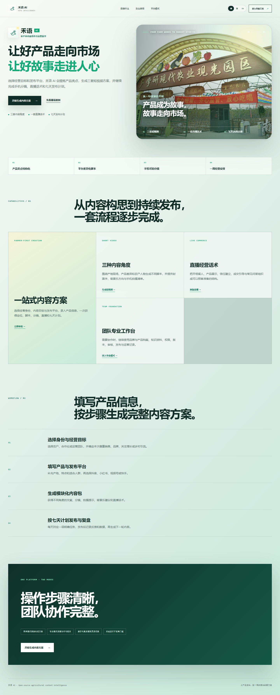

# 禾语 AI · Heyu AI

> 面向农业品牌与产销团队的可信 AI 内容工作台
>
> **让经过审核的产品事实，变成来源可查、版本可审、效果可复盘的营销内容。**

[](https://github.com/KayZhongyi/heyu-ai/actions/workflows/ci.yml)


> 🌱 **欢迎大家加入禾语 AI，一起建设，一起把它做得更好。**

[快速开始](#快速开始) · [当前能力](#当前能力) · [参与开发](#参与开发) · [产品边界](#必须守住的产品边界) · [贡献指南](CONTRIBUTING.md)

禾语 AI 是一个可本地运行、可持续扩展的农产品内容与运营平台。它把品牌档案、农产品事实和审核通过的知识资料组织成可信上下文，生成短视频脚本、直播话术及其他营销内容，并保留完整的来源、版本、审核与运营记录。

仓库目前处于**私有协作与发布前审查阶段**。代码按未来开源标准建设，但在负责人明确批准前，不得公开仓库、业务资料或部署地址。



## 新成员从这里开始

> 第一次加入？先完成下面四步。普通本地演示不需要 Docker、Ollama、Node.js、域名或付费模型 API。

1. 接受 GitHub 私有仓库邀请，将仓库 Clone 到本地；
2. 阅读 [产品范围](docs/product.md) 和 [贡献指南](CONTRIBUTING.md)；
3. 按[快速开始](#快速开始)运行平台，确认首页、工作台与 API 文档可以访问；
4. 在 GitHub Issue 中领取任务，从最新 `main` 创建个人分支，通过 Pull Request 提交。

```powershell
git clone https://github.com/KayZhongyi/heyu-ai.git
cd heyu-ai
.\scripts\setup-windows.ps1
.\scripts\start-windows.ps1
```

**协作约定：** 不直接向 `main` 推送；不提交密钥、数据库或真实业务资料；不确定产品规则或任务边界时，先在 Issue / PR 中确认。

## 当前能力

| 模块 | 已实现 |
| --- | --- |
| 组织与权限 | 多租户组织、六种角色、邀请记录与主动撤销、持久化登录/邀请滥用防护、角色变更即时生效、旧令牌撤销 |
| 品牌资产 | 品牌与农产品档案、编辑、提交审核、通过或退回 |
| 可信知识库 | TXT / Markdown / CSV 导入、来源指纹、修订链、人工审核 |
| AI 内容创作 | 短视频、直播、评论回复、社交文案、标题与封面文案 |
| 可信生成 | 仅使用审核资料、来源引用校验、模型与 Prompt 记录、失败留痕 |
| 内容治理 | 不可覆盖的内容版本、人工修改、提交与审核 |
| 运营闭环 | 发布登记、表现数据快照、人工视频诊断、改进 Brief、后续草稿 |
| 国际化 | 简体中文、香港繁体中文、英文切换；不改写用户业务数据 |
| 工程化 | Windows 本地启动、SQLite、Docker / PostgreSQL、自动化测试与 CI |

## 先看平台

启动后访问：

- 首页：`http://127.0.0.1:8000/`
- 工作台：`http://127.0.0.1:8000/workspace/`
- API 文档：`http://127.0.0.1:8000/docs`
- 健康检查：`http://127.0.0.1:8000/health`

## 快速开始

以下是 Windows 本地开发流程；普通演示仅需 Python 3.12，建议至少预留 2 GB 磁盘空间。

```powershell
git clone https://github.com/KayZhongyi/heyu-ai.git
cd heyu-ai

.\scripts\setup-windows.ps1
.\scripts\start-windows.ps1
```

不使用命令行时，也可以首次双击 `安装禾语AI.bat`，之后双击 `启动禾语AI.bat`。虚拟环境、SQLite 数据库及运行文件默认保存在项目目录中；需要指定 Python 时，可设置环境变量 `HEYU_PYTHON`。

可选 Docker / PostgreSQL：

```bash
cp .env.example .env
docker compose up --build
```

默认使用零成本的 `DeterministicProvider`，用于验证完整业务流程。它不是实际大语言模型。接入外部模型时必须通过 provider 边界，并且不得把 API Key 提交到仓库。

## 仓库结构

```text
apps/
  api/                         FastAPI、SQLAlchemy、Alembic 与业务服务
  web/                         品牌首页与浏览器工作台
docs/
  architecture.md              系统边界与架构
  product.md                   产品范围与业务规则
  operations.md                启动、备份、恢复与运维
  release-gates.md             Demo、工程 MVP 与公网发布门槛
  acceptance-test.md           人工验收流程
scripts/
  audit-repository.py          仓库发布审计
  test-browser-e2e.js          浏览器端到端测试
  test-i18n.js                 三语完整性测试
  test-content-renderer.js     内容渲染测试
```

## 参与开发

开始编码前，请先在 GitHub Issue 或团队沟通渠道中确认任务的**负责人、范围与验收条件**，避免多人重复修改同一模块。

| 方向 | 适合参与的工作 |
| --- | --- |
| 产品与内容 | 真实业务流程、验收用例、简中 / 香港繁中 / 英文营销文案 |
| Web | 工作台交互、响应式布局、可访问性、Playwright E2E |
| API / AI | FastAPI、数据模型、RBAC、知识检索、生成链路、模型 Provider |
| 工程质量 | Pytest、CI、Docker / PostgreSQL、文档与仓库审计 |

推荐使用短生命周期分支，一次 PR 只解决一个明确问题：

```powershell
git switch main
git pull --ff-only
git switch -c feat/short-description

python -m ruff check apps scripts
python -m pytest -q
node scripts/test-i18n.js
node scripts/test-content-renderer.js
```

完整的分支、测试、完成定义与数据安全要求见 [CONTRIBUTING.md](CONTRIBUTING.md)。涉及浏览器行为时再运行：

```powershell
pnpm install --frozen-lockfile
pnpm exec playwright install chromium
pnpm test:e2e
```

## 必须守住的产品边界

- **租户隔离必须由服务端执行**，不能只在前端隐藏按钮。
- **AI 只能使用审核通过的资料**，未知引用和缺失引用必须失败关闭。
- **版本不可覆盖**，修改、审核、发布和复盘都必须留下历史。
- 不提交 `.env`、令牌、API Key、数据库、原始私密 PDF / PPT 或真实客户资料。
- 未经负责人确认，不调用付费服务、不公开仓库、不部署公网。
- 当前范围不包含 VR、医疗功能、数字人直播、联邦学习、区块链或无数据支撑的“爆款预测”。

## 真实能力边界

- `DeterministicProvider` 是开发与演示 provider，不是真实大语言模型。
- `lexical-v1` 是确定性的词法检索，不是向量数据库或完整语义 RAG。
- 视频诊断目前由人工录入结构化证据，不是自动视频理解。
- 发布模块记录发布事实，不会自动向社交平台发帖。
- 运营指标目前由人工录入，不会自动抓取第三方平台数据。
- 当前是工程化 MVP，不等于已获准直接提供公网商业服务。

详细发布条件见 [docs/release-gates.md](docs/release-gates.md)。

## License

[Apache License 2.0](LICENSE)
