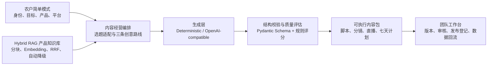

<div align="center">

# 禾语 AI · Heyu AI

### 从农产品资料到短视频、直播与持续运营的一站式 AI 内容工作流

输入产品、产地、经营目标和发布平台，生成三条创意路线、前三秒钩子、完整口播、手机分镜、BGM、直播话术与七天运营计划。

</div>

[](https://github.com/KayZhongyi/heyu-ai/actions/workflows/ci.yml)


**[功能亮点](#为什么值得关注)** · **[5 分钟启动](#5-分钟本地启动)** · **[技术架构](#技术结构)** · **[知识库](#知识库技术)** · **[体验与测试](#如何体验与测试)**

> 🌱 欢迎加入禾语 AI，一起把乡村内容经营做得更简单、更专业。


## 为什么值得关注

禾语 AI 不只是农业领域的一组 Prompt。它提供了一套可以复用到其他垂直行业的 AI 应用架构：**结构化业务输入、可控生成、Hybrid RAG、模型适配、团队协作和运营回流**被连接在同一条产品链路中。

| 亮点 | 能解决什么问题 |
| --- | --- |
| 🎬 **不是只生成文案** | 一次输出标题、钩子、口播、手机分镜、BGM、拍摄准备、直播结构和七天运营安排 |
| 🌾 **真正理解产品怎么拍** | 根据农产品生成不同镜头动作；茶叶会投茶、注水、出汤，百香果会切果、挖果肉、制作气泡饮 |
| 🔥 **热点先判断，再融入** | 使用产品、受众、目标、平台、时效、可拍性六维适配，降低“硬蹭热点”带来的违和感 |
| 🧭 **同一产品给三条路线** | 同时生成实用钩子、人物故事和轻松反差方案，让用户选择，而不是接受唯一答案 |
| 🧠 **Hybrid RAG 产品记忆** | 文本切分、BM25 风格检索、可插拔 Embedding、余弦相似度与 RRF 融合；不可用时自动降级 |
| 🔌 **模型与基础设施解耦** | 默认零成本稳定演示，也能接入 OpenAI-compatible 模型；SQLite 可直接运行，PostgreSQL 可扩展 |
| 🏗️ **从 Demo 到团队工作台** | 多租户、角色权限、知识修订、内容版本、审核、发布登记和运营数据回流已经进入同一套数据模型 |
| 🌏 **三语与多平台表达** | 支持简体中文、香港繁体中文和英文，并针对抖音、小红书、视频号和快手调整内容结构 |

如果你正在构建以下项目，这个仓库也可以作为工程参考：

- 垂直行业 AI Copilot；
- 带知识库和引用记录的内容生成平台；
- 无需 Docker 即可演示、后续又能扩展到 PostgreSQL 的 AI SaaS；
- 同时需要确定性 Demo 与真实模型 Provider 的应用；
- 需要 Schema-constrained Generation、版本管理和人工审核的团队工作流。

## 从资料到内容经营

```text
身份与经营目标
        ↓
产品资料与知识库
        ↓
热点、节气与常青选题适配
        ↓
三条差异化创意路线
        ↓
标题 + 前三秒钩子 + 口播 + 手机分镜 + BGM
        ↓
直播话术 + 七天运营计划
        ↓
保存、编辑、复用与效果回流
```

当前 Demo 已针对番茄、茶叶、百香果、水果和谷物等品类生成不同的镜头语言，而不是统一套用“展示产品”的空泛模板。

想快速体验完整流程，可以查看 [演示指引](docs/demo-showcase.md)，或启动后直接进入 `/create/` 选择一键案例。

## 为什么做禾语 AI

农产品进入新媒体市场，需要连续完成选题、脚本、拍摄、直播和后续运营。现有通用 AI 工具通常只返回一段文案，用户还要自己判断该拍什么、在哪个平台发布，以及下一步怎么继续。

禾语 AI 把这些步骤串成同一条工作流。用户不需要先学习 Prompt，只需要说明这次想卖什么、讲给谁听、准备发到哪里。平台负责把经营任务拆成可以直接执行的内容方案。

平台采用双模式：

- **农户简单模式 `/create/`**：用一张表单完成本次内容经营方案，默认零成本运行。
- **团队专业模式 `/workspace/`**：集中保存经营方案，维护品牌、产品、知识库、内容版本、审核、发布登记、运营记录和成员权限。

## 已经可以使用的功能

### 农户简单模式

当前可以选择：

- 农户、合作社或乡村运营团队；
- 直接销售、建立品牌、积累关注、引流到村等经营目标；
- 抖音、小红书、视频号或快手；
- 朴实自然、温暖故事、活泼表达或克制高级的内容风格；
- 简体中文、香港繁体中文或英文。

农户简单模式一次生成会得到：

1. 产品画像与核心受众；
2. 对应平台的内容重点、时长建议和转化动作；
3. 手工热点、节气农事与常青痛点三类选题信号，以及产品、受众、平台、时效、可拍性和来源适配判断；
4. 实用钩子、人物故事、轻松反差三条可选择的创意路线；
5. 每条视频的标题、封面文案、前三秒钩子、完整口播、背景乐方向、产品特定分镜、手机拍摄提示、规则质量分和改进建议；
6. 一套直播讲解结构；
7. 七天发布与运营计划；
8. 从选路线、准备拍摄到保存经营方案的连续下一步引导。

公共页面默认使用 `DeterministicMarketingProvider`，不消耗模型额度，也不要求 API Key，因此任何使用者都能稳定复现完整流程。需要更开放的语言生成时，可以切换到 OpenAI-compatible Provider。

热点辅助当前用于**选题规划与适配判断**：系统记录信号类型，并优先判断热点与产品、受众和拍摄条件是否匹配，而不是机械追逐热词。

生成完成后，可以把整套方案保存到团队工作台。已经登录的成员可直接保存；尚未登录时，方案会在当前浏览器会话中临时保留，登录后再导入，不需要重新生成。

### 团队专业模式

当前已经实现：

| 模块 | 已实现能力 |
| --- | --- |
| 组织与权限 | 多租户组织、Owner / Admin / Product Manager / Creator / Reviewer / Viewer、邀请、撤销与角色权限 |
| 经营方案库 | 保存简单模式的完整经营方案，再次打开、可读预览、结构化编辑、复制复用和不覆盖旧内容的版本记录 |
| 品牌与产品 | 品牌、农产品档案、编辑、提交、审核以及修改后的重新审核 |
| 知识库 | TXT / Markdown / CSV / PDF / PPTX 导入，PDF/PPTX 本地文字提取，品牌与产品关联，SHA-256 指纹，线性修订与审核 |
| 知识检索 | 文本分块、BM25 风格词法召回、可插拔 Embedding、余弦相似度与 RRF 混合排序；Embedding 不可用时自动降级 |
| 内容生产 | 短视频、手机拍摄清单、直播话术、评论回复、社交文案、标题与封面文案 |
| 模型适配 | 零成本 Mock 与 OpenAI-compatible 适配层；真实模型失败时可配置自动降级，重复请求支持有界 TTL 缓存 |
| 内容治理 | 不覆盖的内容版本、人工修改、提交审核、来源记录和生成失败留痕 |
| 运营闭环 | 发布登记、表现数据快照、人工视频诊断、改进 Brief 和后续草稿 |
| 材料导出 | 生成可继续编辑的 16:9 PPTX 营销材料 |
| 国际化 | 简体中文、香港繁体中文和英文界面切换，不改写用户录入的业务资料 |
| 工程运行 | Windows 本地运行、SQLite、可选 Docker/PostgreSQL、自动化测试与 GitHub Actions |

知识库不是独立的“审核产品”，而是 AI 内容生产的底层产品记忆。农户以后可以复用产地、品种、种植方式、规格、品牌故事和历史内容，不必每次从头填写。

## 5 分钟本地启动

### Windows 最简单方式

源码或 ZIP 方式需要先安装 **Python 3.12**。第一次安装会通过 `pip` 下载依赖，通常需要联网；安装完成后的日常启动不需要 Docker、Ollama、Node.js、域名或付费 API。

1. 点击 GitHub 页面右上方绿色 **Code** 按钮；
2. 点击 **Download ZIP**；
3. 解压到空间充足的目录，推荐 D 盘；
4. 第一次双击 `安装禾语AI.bat`；
5. 安装完成后双击 `启动禾语AI.bat`；
6. 浏览器打开后，从首页进入“开始一次内容经营”。

如果电脑上没有 Python 3.12，安装脚本会给出明确提示。项目建议放在 D 盘等空间充足的位置，虚拟环境和本地数据库都会保存在项目目录内。
平台会在后台运行；使用结束后双击 `停止禾语AI.bat` 即可安全停止本项目启动的服务。

也可以使用 PowerShell：

```powershell
git clone https://github.com/KayZhongyi/heyu-ai.git
cd heyu-ai
.\scripts\setup-windows.ps1
.\scripts\start-windows.ps1
```

启动后访问：

- 首页：`http://127.0.0.1:8000/`
- 农户简单模式：`http://127.0.0.1:8000/create/`
- 团队专业模式：`http://127.0.0.1:8000/workspace/`
- API 文档：`http://127.0.0.1:8000/docs`
- 健康检查：`http://127.0.0.1:8000/health`

GitHub 仓库公开只代表任何人都可以查看和下载代码，**不等于已经拥有一个在线网址**。不想安装时，仍需把仓库部署到 Render 等托管平台；参见 [Render Demo 指南](docs/render-demo.md)。

## 演示数据重置

需要重新录制或从空白状态演示时：

1. 双击 `重置禾语AI演示.bat`，脚本会先停止由本项目启动的本地服务；
2. 输入 `RESET`；
3. 再次启动平台。

重置脚本只处理 Windows 源码启动器使用的 `data/heyu.db`，默认先备份到 `data/backups/`，再创建干净环境；它不会重置自定义 `DATABASE_URL`、便携版目录或 PostgreSQL。确认不需要备份时，开发者可以执行：

```powershell
.\scripts\reset-local-demo.ps1 -SkipBackup -Force
```

## 连接国产模型

禾语 AI 不绑定单一厂商。当前完成的是 OpenAI-compatible 协议适配和模拟响应测试：服务需要支持 Bearer Token、`POST /v1/chat/completions`、`response_format=json_object`，并能在 `choices[0].message.content` 中返回符合营销方案 Schema 的 JSON。可评估通义千问、DeepSeek 或其他兼容服务，但仓库尚未完成具体国产模型厂商和模型版本的端到端认证。

复制 `.env.example` 为 `.env`：

```dotenv
AI_PROVIDER=openai-compatible
AI_BASE_URL=https://your-provider.example/v1
AI_MODEL=your-model-name
AI_API_KEY=replace-with-your-own-key
AI_TIMEOUT_SECONDS=45

MARKETING_CACHE_TTL_SECONDS=900
MARKETING_CACHE_MAX_ENTRIES=256
MARKETING_FALLBACK_TO_MOCK=true
```

说明：

- ChatGPT/Codex 订阅不是模型 API Key；
- API Key 只保存在本地或部署环境变量中，不要提交到 Git；
- 公共 `/create/` 预览始终使用零成本 Mock，避免公开页面无限消耗额度；
- 需要真实模型的生成接口要求登录；
- 相同输入可以在 TTL 内复用缓存；
- 模型超时、网络失败或结构校验失败时，可按配置切换到 Mock 降级结果，并显式标记 `degraded`，不会伪装成真实模型输出。

## 知识库技术

当前知识库采用 **Hybrid RAG 优先、词法检索自动降级** 的实现，由 FastAPI、SQLAlchemy 和 SQLite/PostgreSQL 共同承载：

```text
资料导入
→ PDF/PPTX 本地文字提取
→ 用户确认与结构化保存
→ 品牌/产品关联
→ SHA-256 内容指纹
→ 线性修订与审核
→ 句子边界优先的文本分块
→ BM25 风格词法召回 + 可插拔 Embedding
→ 余弦相似度 + RRF 混合排序
→ Chunk 级生成上下文、引用与检索清单
```

Embedding 向量以标准 JSON 持久化，避免把 Docker、专用向量数据库或大型本地模型设为使用门槛。配置兼容的 Embedding 服务时，检索策略为 `hybrid-rag-v1`；未配置、服务失败或候选资料尚无向量时，系统自动降级到 `lexical-v1-fallback`，内容生成流程仍可继续运行。

每个检索结果会保留 `source_id`、`chunk_id`、字符位置、内容哈希、词法排名、向量排名、RRF 分数、检索策略和降级原因。生成接口只接受服务端允许列表中的引用来源，避免模型自行虚构来源 ID。

## 技术结构

平台把经营任务、AI 生成和团队资产分开建模。前端只负责收集农产品资料和展示可执行结果；FastAPI 服务负责编排选题、脚本、知识检索和运营流程；Provider 层负责在零成本 Demo 与真实模型之间切换。模型返回内容必须经过 Pydantic Schema 校验，才能进入页面、版本库和后续工作流。



主要工程组件：

- Python 3.12、FastAPI、Pydantic；
- SQLAlchemy 2.x、Alembic、SQLite/PostgreSQL；
- BM25 风格检索、可插拔 Embedding、余弦相似度、RRF 融合与 Chunk 级引用；
- 可插拔 AI Provider、Schema-constrained JSON 生成、超时与降级；
- Pytest、Playwright、MyPy、Ruff 和 GitHub Actions；
- 原生 HTML、CSS、JavaScript 响应式界面，不要求 Docker 或前端构建工具才能体验。

## 三类演示案例

农户简单模式提供三个可一键生成的完整案例，自动化测试同时覆盖桌面端与移动端：

- 当季番茄：突出成熟度、采摘现场和家庭食用场景；
- 高山茶叶：突出产区、工艺、香气和冲泡场景；
- 当季水果：突出成熟窗口、口感、采收和家庭分享场景。

在 `/create/` 点击任一案例，平台会按当前语言自动填入身份、目标、产品、卖点、平台、语气和热点信息，并直接生成策略、三条短视频、直播话术及七天计划。手动修改表单后，案例高亮会自动取消，避免把用户输入误认为模板内容。

## 当前能力与建设路线

### 已自动完成

- 农户经营任务结构化；
- 平台差异化策略；
- 热点、节气与常青选题信号的来源标识、六维适配判断和“不建议追”的降级建议；
- 实用钩子、人物故事、轻松反差三条创意路线；
- 三条短视频、分镜、拍摄建议、背景乐方向、规则质量评估和改进建议；
- 直播话术结构；
- 七天运营计划；
- 从选题、选路线、准备拍摄到保存方案的连续下一步引导；
- 完整经营方案保存、再次打开、编辑、复制与版本追踪；
- 零成本 Mock 演示；
- 文档文字提取、版本、权限、审核和来源记录；
- 文本分块、BM25 风格召回、可插拔 Embedding、RRF 混合排序和词法自动降级；
- PPTX 营销材料导出。

### 需要部署者配置

- 选择并授权真实国产模型服务；
- 配置 API Key、模型名称和服务地址；
- 正式部署时配置 PostgreSQL、HTTPS、密钥、备份和监控；
- 获得抖音、小红书、视频号等第三方平台的合法接口授权。

### 接下来建设

| 方向 | 已有基础 | 实施方式 |
| --- | --- | --- |
| RAG 质量与规模 | Hybrid RAG、Chunk 引用、检索清单和自动降级 | 增加 Embedding 模型一致性检查、页码/幻灯片定位、离线引用评测；数据量扩大后再迁移 pgvector |
| 热点辅助 | 手工信号、RSS/Atom、授权平台适配器和六维评分 | 扩充合规数据源与时效排序，让热点更自然地进入前三秒钩子和完整脚本 |
| 模型质量评测 | Provider、结构校验、Mock 降级 | 建立脱敏农产品题集，对事实准确性、营销表达、三语质量、延迟和成本评分 |
| 运营数据回流 | 人工数据快照、诊断和后续草稿 | 支持 CSV/Excel 导入，再在获得授权后连接平台 API |
| 自动视频理解 | 人工诊断结构和改进 Brief | 增加视频上传、语音转写、镜头/字幕切分和多模态分析 |
| 发布协作 | 内容版本和发布登记 | 先提供各平台复制/导出格式，获得授权后增加定时发布、失败重试和回执 |
| 模型设置界面 | `.env` Provider 配置 | 增加管理员连接测试；密钥仅服务端保存，不返回浏览器 |
| 正式商业运行 | PostgreSQL、迁移、审计、CI | 完成隐私政策、数据保留、监控告警、恢复演练和安全验收 |

当前发布登记不是自动发布，运营数据主要由人工录入，视频诊断目前也是人工流程。这些能力已经有可持续扩展的数据结构，但不应被描述成已经连接第三方平台。

## 仓库结构

```text
apps/
  api/                         FastAPI、SQLAlchemy、迁移与业务服务
  web/                         首页、农户简单模式与团队专业模式
docs/
  architecture.md              系统架构与工程边界
  product.md                   产品范围与业务规则
  platform-v2-plan.md          农户内容经营平台建设规划
  operations.md                启动、备份、恢复与运维
  release-gates.md             Demo、工程 MVP 与生产发布门槛
scripts/
  reset-local-demo.ps1         安全重置本地演示数据
  seed_demo_workspace.py       初始化合成团队演示资料
  setup_demo_accounts.py       创建演示账号
  test-browser-e2e.js          Playwright 浏览器端到端测试
  audit-repository.py          仓库发布审计
```

## 如何体验与测试

### 体验完整内容生成

1. 按照上方“5 分钟本地启动”运行项目；
2. 打开 `http://127.0.0.1:8000/create/`；
3. 选择当季番茄、高山茶叶或当季水果案例，也可以填写自己的产品；
4. 选择经营目标、发布平台、表达风格和热点信号；
5. 查看三条创意路线，并继续查看脚本、手机分镜、BGM、直播话术与七天计划；
6. 将结果保存到团队工作台，测试再次打开、编辑和复制复用。

### 体验知识库如何进入 AI 内容

1. 打开 `http://127.0.0.1:8000/workspace/`，首次使用时创建本地组织与 Owner 账号；
2. 在“品牌与产品”中创建测试品牌和农产品；
3. 进入“内容资料库”，粘贴文字或导入 TXT、Markdown、CSV、PDF、PPTX；
4. 保存资料、提交审核，并由 Owner 或 Reviewer 批准；
5. 创建关联该品牌和产品的内容项目；
6. 生成内容后检查知识来源、Chunk 引用和检索策略；
7. 不配置 Embedding 时可以观察 `lexical-v1-fallback`，配置兼容的 Embedding 服务后可以验证 `hybrid-rag-v1`。

所有测试资料建议使用公开或合成内容，不要把 API Key、真实客户资料、本地数据库或私密文件提交到 Git。

<details>
<summary><strong>开发者验证命令</strong></summary>

```powershell
.\.venv\Scripts\python.exe -m ruff check apps scripts
.\.venv\Scripts\python.exe -m pytest -q
node scripts/test-i18n.js
node scripts/test-content-renderer.js
node scripts/test-browser-e2e.js
.\.venv\Scripts\python.exe scripts/audit-repository.py
```

当前浏览器 E2E 会验证三语首页、三类一键案例、完整经营方案生成与保存、再次打开、编辑新版本、旧版本保留、复制复用、只读角色权限、语言切换数据保持以及 390px 移动端布局。Windows 便携构建还会通过 `acceptance-smoke.py` 验证首页、简单模式、营销预览、知识生命周期、内容生成和运营闭环。

涉及数据库结构时还需验证 Alembic 升降级；涉及在线部署时还需验证 PostgreSQL、备份恢复、生产配置和真实浏览器流程。详细门槛见 [发布门槛](docs/release-gates.md)。

</details>

## License

[Apache License 2.0](LICENSE)
