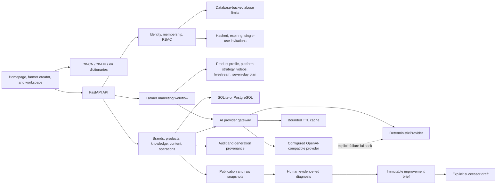
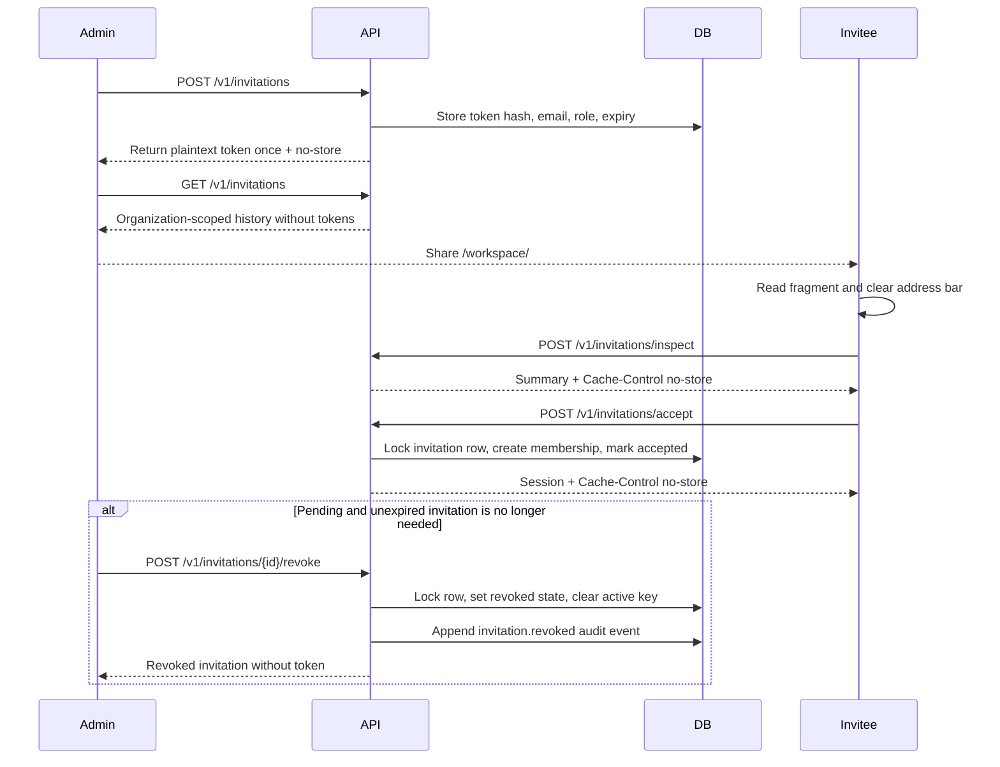

# Architecture

## Deployment profiles

- **Local demo:** SQLite plus the deterministic provider; no paid service.
- **External-model development:** SQLite/PostgreSQL plus an explicitly
  configured OpenAI-compatible API.
- **Team/production candidate:** PostgreSQL, production secrets, explicit HTTPS
  origins, durable backups, and an approved provider.

The same modular-monolith application supports all profiles. Ollama, Docker
Desktop, and a paid API are not prerequisites.

## System shape

Long-running ingestion, media processing, and provider calls are future worker
candidates. Premature microservice decomposition is intentionally avoided.

The public farmer preview always uses the deterministic provider so that a
shared demo cannot consume an API key without a bound. Authenticated farmer
generation can use the configured OpenAI-compatible provider. Repeated
requests use a bounded in-process TTL cache; provider failures can return an
explicitly marked deterministic result when fallback is enabled. This cache
is a single-process MVP optimization, not a substitute for a shared production
cache when multiple application instances are deployed.

## Tenant isolation

Tenant-owned tables include non-null `organization_id`. Authenticated service
operations scope reads and writes by actor and organization. Cross-tenant
negative tests cover domain modules. PostgreSQL row-level security remains a
future defense-in-depth option, not a claimed current control.

## AI provenance and retrieval

Each generation stores:

- provider and model
- prompt template and version
- normalized content brief
- source IDs and resolved citation labels
- raw structured output
- latency, status, creator, and organization

Before a provider call, `lexical-v1` selects a bounded context from the latest
approved revision in each eligible chain. Product scope is preferred; Chinese
character n-grams and Latin terms provide lightweight relevance ordering.
Hard source and character limits prevent unbounded prompts. The context
manifest stores source and excerpt hashes, included character counts, scope,
and truncation state.

The generation service also reloads the tenant-scoped brand and product and
requires both records to be `approved`. A material edit resets the affected
asset to `draft`, clears its prior reviewer metadata, and blocks subsequent
generation until another explicit review.

Provider success is not trusted at the HTTP boundary. The domain service
validates the returned object against the requested content type, requires
explicit `citations` and `risk_notes` arrays, and rejects every citation whose
`source_id` was not selected into that run's bounded context. Prompt
instructions are a generation aid, not a substitute for server-side
validation.

Provider timeouts, transport/HTTP failures, malformed responses, schema
failures, and unavailable citations are committed as
`GenerationRun(status=failed)` with a stable safe error code. Failed runs never
create a `ContentVersion`; raw provider responses, authorization headers, and
API keys are not persisted.

This is deliberately not called semantic RAG. PostgreSQL search or embeddings
can replace the policy later without changing provenance or provider
interfaces.

## Internationalization

The browser loads one i18n runtime and explicit dictionaries for `zh-CN`,
`zh-HK`, and `en`. Static HTML and dynamic application messages resolve through
the same translation keys. Locale state is browser-local and does not mutate
API records.

Business-data nodes are marked with `data-business-data` or
`data-i18n-ignore`; translation traversal must not alter them. Dictionary tests
check key parity and placeholders. Browser E2E verifies that unsaved form
values and saved brand data remain unchanged across locale switches.

## Secure invitation flow

Fragments keep tokens out of ordinary request paths and server access logs, but
do not prevent browser extensions, screen capture, or recipient disclosure.
Tokens therefore remain expiring and single-use. A conditional uniqueness key
prevents duplicate active invitations for one organization and normalized
email. Clearing that key on acceptance, revocation, or expiry permits a
replacement invitation while preserving the original record.

The invitation state machine permits only `Pending → Accepted`,
`Pending → Revoked`, or `Pending → Expired`. List, revoke, and audit responses
never include the plaintext token or its hash. Creation, inspection, and
acceptance responses use `Cache-Control: no-store`. Owner and Admin can list and
revoke invitations within their organization, but Admin cannot create or revoke
an Owner invitation.

## Authentication and invitation abuse controls

Bootstrap, login, invitation creation, token inspection, and invitation
acceptance consume fixed-window buckets in the primary database. This keeps
limits durable across application restarts and shared by multiple workers or
instances without introducing Redis as a deployment prerequisite.

Bucket subjects are HMAC-SHA-256 values derived with `APP_SECRET`; raw client
addresses, emails, organization identifiers, user identifiers, and invitation
tokens are never stored in the limiter table. Target-specific buckets reduce
password and token guessing, while broader network, organization, and actor
buckets bound distributed target rotation and invitation resource abuse.
Responses use `429 Too Many Requests`, `Retry-After`, and
`Cache-Control: no-store`.

`X-Forwarded-For` is ignored by default. It is parsed only when the immediate
peer belongs to `TRUSTED_PROXY_CIDRS`, and the chain is walked from the nearest
proxy toward the first untrusted address. Production refuses to start when
abuse controls are disabled. Expired buckets are periodically removed using
the configurable retention interval.

## Verification architecture

- Python tests exercise domain behavior, state transitions, permissions, and
  tenant boundaries.
- SQLite Alembic round trips check current migrations in the API CI job.
- Playwright runs a real browser against a temporary API for localization,
  invitation handling, and responsive layout evidence.
- Windows CI installs and starts through the user-facing scripts.
- Docker CI applies migrations to empty PostgreSQL, exercises the deployment,
  restarts it, and performs backup/restore into a fresh volume.
- Repository audit rejects private documents, databases, secrets, and common
  credential patterns.
