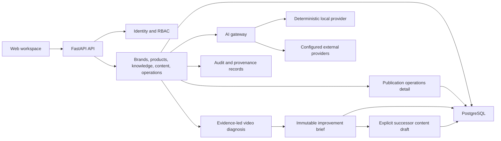

# Architecture

## Deployment profiles

- **Local demo:** SQLite, local files, deterministic mock AI. No paid service.
- **Local AI:** SQLite/PostgreSQL plus an optional local model runtime.
- **Team/production:** PostgreSQL, private object storage, job workers, and a
  configured AI provider.

The same application code supports all profiles. The free local profile is not
a separate throwaway demo.

## Shape

The MVP uses a modular monolith for transactional business logic and an
AI-provider boundary designed to move long-running work into workers without
rewriting domain services.

## Tenant isolation

Tenant-owned tables include a non-null `organization_id`. Service methods
receive an authenticated actor and organization context, then scope every read
and mutation by both. Cross-tenant behavior has explicit negative tests.
PostgreSQL row-level security is planned as defense in depth before production.

## AI provenance

Each generation stores:

- provider and model
- prompt template name and version
- normalized input brief
- source document IDs
- raw structured output
- latency and status
- creator and organization

Before the provider call, the application selects a bounded context from the
latest approved revision in each eligible knowledge chain. The first policy is
deterministic and provider-neutral: product scope is preferred, Chinese
character n-grams and Latin terms provide lightweight relevance ordering, and
hard source/character limits prevent unbounded prompts. The normalized input
records the policy, selected source IDs, full-source SHA-256 values,
excerpt SHA-256 values, included character counts, and truncation flags.

This is intentionally not presented as semantic vector search. PostgreSQL
full-text search or embeddings can replace the ranking policy later without
changing generation provenance or provider interfaces.

Content versions reference the generation that produced them but remain
editable through append-only successor versions.

## Evolution

The first extraction candidates are document ingestion/video processing workers
and model calls. They will use durable jobs and object storage when those
features enter scope. Premature service decomposition is intentionally avoided.
